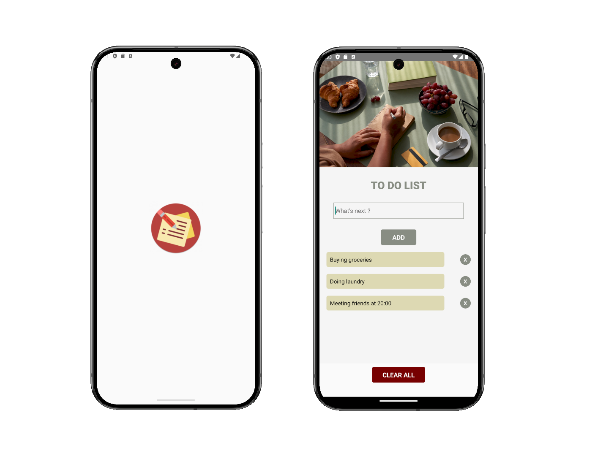

# To Do List

This mobile app  allows users to create, view, and manage tasks or items. This app is commonly used on a mobile device for task organization and helps users stay productive.

## Educational Purpose

- Adding new tasks
- Viewing a list of tasks
- Deleting tasks that are no longer needed

## Screenshots

## 🍞 About Me
Hi everyone, I'm Madame R. a Web Developer from France. 
Currently in training, I'm a database enthusiast.
Enjoy your stay, have a look at my other repositories and let's get in touch if you wish to work with me.

## Tech Stack

**Database:** MySQL Workbench, Doctrine

**Back End:** PHP, Symfony

**Front End:** HTML, CSS, Javascript, React

**IDE:** Visual Studio Code

## Acknowledgements

 Front End
 - [Pressfoto  for the picture ](https://fr.freepik.com/auteur/pressfoto)

## License

